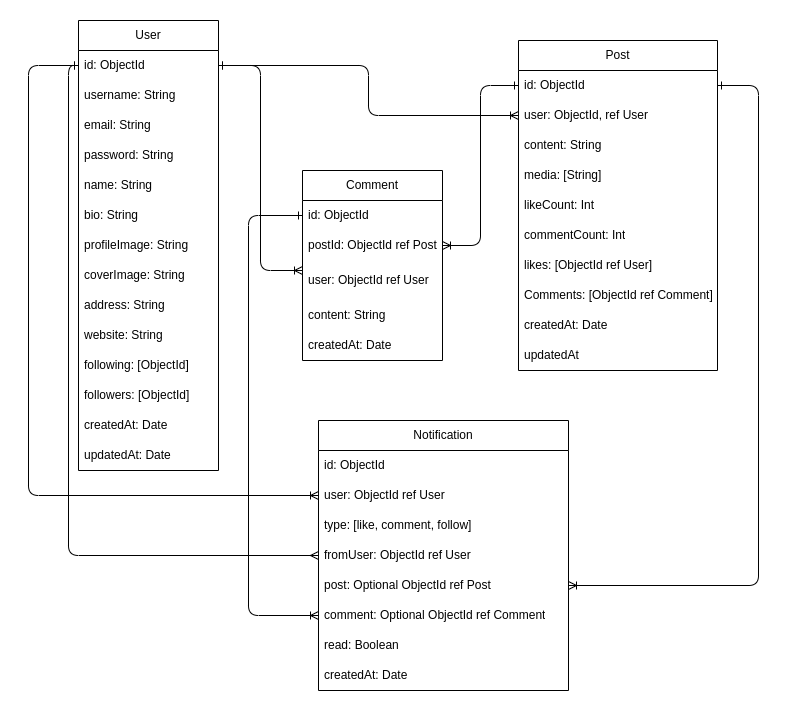

# NodeSocial

a basic social media feed where users can register, log in, post updates, like posts, and follow other users.

## Features

- [ ] User registration and authentication
- [ ] User can post and delete updates
- [ ] User can view other users' posts
- [ ] User can follow and unfollow other users
- [ ] User can like and unlike posts
- [ ] User can comment on posts
- [ ] User can create and edit their profile
- [ ] User can view other users' profiles

## Technologies Used

- [Node.js](https://nodejs.org/en/) - JavaScript runtime.
- [Express.js](https://expressjs.com/) - Web framework for Node.js.
- [MongoDB](https://www.mongodb.com/) - NoSQL database.
- [Mongoose](https://mongoosejs.com/) - ODM for MongoDB and Node.js.
- [S3](https://aws.amazon.com/s3/) - Object storage service for storing media files.
- [Jest](https://jestjs.io/) - JavaScript testing framework.
- [AWS](https://aws.amazon.com/) - Cloud computing platform.
- [GitHub Actions](https://docs.github.com/en/actions) - CI/CD pipeline for testing and deploying the application.
- [Docker](https://www.docker.com/) - Containerization platform for deploying the application.
- [Redis](https://redis.io/) - In-memory data structure store for caching.

## Database Design

